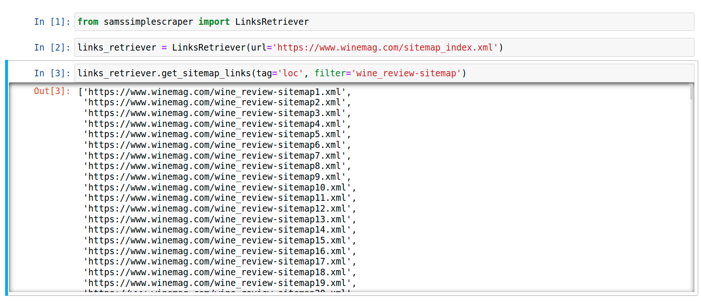

<div id="top"></div>

<h3 align="center">Simple Scraper</h3>

<br />
<div align="center">
  <a href="https://github.com/SamuelAdamsMcGuire/simplescraper">
    
  </a>


  <p align="center">
    project_description
    <br />
    <a href="https://github.com/SamuelAdamsMcGuire/simplescraper"><strong>Explore the docs »</strong></a>
    <br />
    <br />
    <a href="https://github.com/SamuelAdamsMcGuire/simplescraper">View Demo</a>
    ·
    <a href="https://github.com/SamuelAdamsMcGuire/simplescraper/issues">Report Bug</a>
    ·
    <a href="https://github.com/SamuelAdamsMcGuire/simplescraper/issues">Request Feature</a>
  </p>
</div>


<!-- TABLE OF CONTENTS -->
<details>
  <summary>Table of Contents</summary>
  <ol>
    <li>
      <a href="#about-the-project">About The Project</a>
      <ul>
        <li><a href="#built-with">Built With</a></li>
      </ul>
    </li>
    <li>
      <a href="#getting-started">Getting Started</a>
      <ul>
        <li><a href="#prerequisites">Prerequisites</a></li>
        <li><a href="#installation">Installation</a></li>
      </ul>
    </li>
    <li><a href="#usage">Usage</a></li>
    <li><a href="#roadmap">Roadmap</a></li>
    <li><a href="#contributing">Contributing</a></li>
    <li><a href="#license">License</a></li>
    <li><a href="#contact">Contact</a></li>
  </ol>
</details>


<!-- ABOUT THE PROJECT -->
## About The Project

After writing this program to help me scrape some sitemaps and eventually the links they scraped I though I would package it for repeated use. 

<p align="right">(<a href="#top">back to top</a>)</p>


### Built With

* [Python](https://www.python.org/)
* [Beautifulsoup](https://www.crummy.com/software/BeautifulSoup/bs4/doc/)

<p align="right">(<a href="#top">back to top</a>)</p>


<!-- GETTING STARTED -->
## Getting Started

This is currently a placeholder README that will be updated with more detailed instructions very soon. Thanks for understanding.

### Prerequisites

This program used python 3.8

### Installation

Option 1 is to clone the repo and use the code but the simpler approach would be to `pip` install the package and use as needed. 

Install `pip` package
  ```sh
  pip install samssimplescraper==0.1.0
  ```

At this point in order to use the method `get_html()` please have the following folder structure inside of your project folder:
```
─ data
   ├── scraped_html
   └── pickled_lists
─ scraper.py
```
                
<p align="right">(<a href="#top">back to top</a>)</p>


<!-- USAGE EXAMPLES -->
## Usage

The package has two modules. 

1. `sitemapscraper` is used to scrape sitemaps and can also scrape further levels of sub-sitemaps The methods will return lists of the scraped links that can be used to scrape the wanted links.
2. `scraper` is used to scrape the the list that is returned from the sitemapscraper or a user-made list of links. There is also a method that returns a status check of how many links have been scraped of the total. 

_For more examples, please refer to the [Documentation](https://example.com)_

<p align="right">(<a href="#top">back to top</a>)</p>


<!-- ROADMAP -->
## Roadmap

1. Find sitemap for the site you are looking to scrape. Some tips can be found here:

  [how-to-find-your-sitemap](https://writemaps.com/blog/how-to-find-your-sitemap/)
  https://writemaps.com/blog/how-to-find-your-sitemap/

2. Scrape sitemap:

```python
from samssimplescraper import LinksRetriever

# instantiate LinksRetriever with the sitemap you wish to scrape
links_retriever = LinksRetriever(url='https://www.example.com/sitemap_index.xml')
# get a list of the link using .get_sitemap_links method, can also add filter
mainpage_links = links_retriever.get_sitemap_links(tag='loc')
# if website has more layers use the method to get the links on those pages
more_links = links_retriever.get_next_links(links=mainpage_links, tag='loc')
```

3. At this point the folder structure above is vital. Otherwise the program will return errors. I have plans to make this automated when I have a chance. Now you can scrape the list of links that the `LinksRetriever` module has produced for you. The files will be saved in the `data` folder.

```python
from samssimplescraper import Scraper

# define a header to mask your scraper as a browswer
HEADER = <define a browser header>
# pass the list of links and for naming purposes the root_url
Scraper.get_html(link_list=more_links, root_url='https://www.example.com/, headers=HEADER)
``` 


See the [open issues](https://github.com/SamuelAdamsMcGuire/simplescraper/issues) for a full list of proposed features (and known issues).

<p align="right">(<a href="#top">back to top</a>)</p>


<!-- CONTRIBUTING -->
## Contributing

Contributions are what make the open source community such an amazing place to learn, inspire, and create. Any contributions you make are **greatly appreciated**.

If you have a suggestion that would make this better, please fork the repo and create a pull request. You can also simply open an issue with the tag "enhancement".
Don't forget to give the project a star! Thanks again!

1. Fork the Project
2. Create your Feature Branch (`git checkout -b feature/AmazingFeature`)
3. Commit your Changes (`git commit -m 'Add some AmazingFeature'`)
4. Push to the Branch (`git push origin feature/AmazingFeature`)
5. Open a Pull Request

<p align="right">(<a href="#top">back to top</a>)</p>


<!-- LICENSE -->
## License

Distributed under the MIT License. See `LICENSE.txt` for more information.

<p align="right">(<a href="#top">back to top</a>)</p>


<!-- CONTACT -->
## Contact

Samuel Adams McGuire - samuelmcguire@engineer.com

Pypi Link: [https://pypi.org/project/samssimplescraper/0.0.2/](https://pypi.org/project/samssimplescraper/0.1.0/)

Linkedin: [LinkedIn](https://www.linkedin.com/in/samuel-mcguire/)

Project Link: [https://github.com/SamuelAdamsMcGuire/simplescraper](https://github.com/SamuelAdamsMcGuire/simplescraper)

<p align="right">(<a href="#top">back to top</a>)</p>
